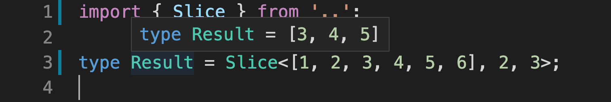

## 📚 Meta-Typing

> Lodash's functions and various algorithms implemented purely with TypeScript's type system

### Introduction

[TypeScript](https://github.com/Microsoft/TypeScript)'s type system is a programming language that runs when we compile our code. Normally, we use it to annotate our code so TypeScript can help us find bugs before we run it. In this project, however, I tried to push TypeScript's type system to its limits by implementing many of [Lodash](https://github.com/lodash/lodash)'s functions, purely on the shoulders of the type system.

The goal of this project is educational and humoristic. I used recursion a lot and had to find creative solutions to overcome [some limitations](https://github.com/microsoft/TypeScript/issues/28663) of the type system. Even though I tried, it's impossible to implement a handful of functions until [several features](https://github.com/microsoft/TypeScript/issues/1213) are implemented in TypeScript.

Just to see how far I can push it, I tried implementing the classical [Eight queens puzzle](https://en.wikipedia.org/wiki/Eight_queens_puzzle). It's crazy that it actually works, [check it out](src/queens/index.d.ts).

### Run the code locally

Every function has its own folder inside the [src](src) folder. In each folder, you will find the function implementation and a test file for that function. I added comments to each function's code to explain what's going on.

Start by installing dependencies:

```
$ npm install
```

Open a file of any function and hover over the types to see the results of "running" that function with some input (try hovering the resulting type):



You can also run tests (written with [tsd](https://github.com/SamVerschueren/tsd)) with:

```
$ npm test
```

Here's the list of currently implemented functions:

#### Math:

- [Basic arithmetic [src/utils/math.d.ts]](src/utils/math.d.ts)
- [Add [src/add/index.d.ts]](src/add/index.d.ts)
- [Substract [src/substract/index.d.ts]](src/substract/index.d.ts)
- [Multiply [src/multiply/index.d.ts]](src/multiply/index.d.ts)
- [Divide [src/divide/index.d.ts]](src/divide/index.d.ts)
- [Greater than or equal [src/gte/index.d.ts]](src/gte/index.d.ts)
- [Less than or equal [src/lte/index.d.ts]](src/lte/index.d.ts)
- [Clamp [src/clamp/index.d.ts]](src/clamp/index.d.ts)
- [Max [src/max/index.d.ts]](src/max/index.d.ts)
- [Min [src/min/index.d.ts]](src/min/index.d.ts)
- [Sum [src/sum/index.d.ts]](src/sum/index.d.ts)

#### Lists

- [Head [src/head/index.d.ts]](src/head/index.d.ts)
- [Tail [src/tail/index.d.ts]](src/tail/index.d.ts)
- [Reverse [src/reverse/index.d.ts]](src/reverse/index.d.ts)
- [Size [src/size/index.d.ts]](src/size/index.d.ts)
- [Concat [src/concat/index.d.ts]](src/concat/index.d.ts)
- [Drop [src/drop/index.d.ts]](src/drop/index.d.ts)
- [Take [src/take/index.d.ts]](src/take/index.d.ts)
- [Uniq [src/uniq/index.d.ts]](src/uniq/index.d.ts)
- [Last [src/last/index.d.ts]](src/last/index.d.ts)
- [Includes [src/includes/index.d.ts]](src/includes/index.d.ts)
- [IndexOf [src/indexOf/index.d.ts]](src/indexOf/index.d.ts)
- [Difference [src/difference/index.d.ts]](src/difference/index.d.ts)
- [Intersection [src/intersection/index.d.ts]](src/intersection/index.d.ts)
- [Slice [src/slice/index.d.ts]](src/slice/index.d.ts)
- [Flatten [src/flatten/index.d.ts]](src/flatten/index.d.ts)
- [Initial [src/initial/index.d.ts]](src/initial/index.d.ts)
- [Pull [src/pull/index.d.ts]](src/pull/index.d.ts)
- [Compact [src/compact/index.d.ts]](src/compact/index.d.ts)
- [Chunk [src/chunk/index.d.ts]](src/chunk/index.d.ts)
- [Zip [src/zip/index.d.ts]](src/zip/index.d.ts)
- [Range [src/range/index.d.ts]](src/range/index.d.ts)
- [Nth [src/nth/index.d.ts]](src/nth/index.d.ts)

#### Sorting

- [Quick-sort [src/quickSort/index.d.ts]](src/quickSort/index.d.ts)
- [Merge-sort [src/mergeSort/index.d.ts]](src/mergeSort/index.d.ts)

#### Utility

- [IsEqual [src/isEqual/index.d.ts]](src/isEqual/index.d.ts)
- [InRange [src/inRange/index.d.ts]](src/inRange/index.d.ts)

### Additional links

- [Utility TypeScript types](https://www.typescriptlang.org/docs/handbook/utility-types.html)
- [Advanced TypeScript types](https://www.typescriptlang.org/docs/handbook/advanced-types.html)
- [TypeScript video tutorials from Egghead.io](https://egghead.io/browse/languages/typescript)
- [TypeScripts Type System is Turing Complete](https://github.com/microsoft/TypeScript/issues/14833)
- [Emulating a 4-Bit Virtual Machine in TypeScript's type system](https://gist.github.com/acutmore/9d2ce837f019608f26ff54e0b1c23d6e)
