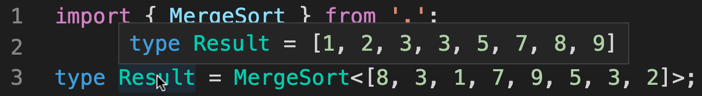

## 📚 Meta-Typing

> Various functions and algorithms implemented purely with TypeScript's type system

### Introduction

[TypeScript](https://github.com/Microsoft/TypeScript)'s type system is a programming language that runs when we compile our code. Normally, we use it to annotate our code so TypeScript can help us find bugs before we run it. In this project, however, I tried to push TypeScript's type system to its limits by implementing various functions and algorithms, purely on the shoulders of the type system.

The goal of this project is to explore TypeScript's type system in an unconventional way. I used recursion a lot and had to find creative solutions to overcome [some limitations](https://github.com/microsoft/TypeScript/issues/26223#issuecomment-513187373) of the type system. Each function and algorithm has its own implementation with comments describing in detail what's going on.

Just to see how far I can push it, I tried implementing the classical [Eight queens puzzle](https://github.com/trekhleb/javascript-algorithms/tree/master/src/algorithms/uncategorized/n-queens). It's crazy that it actually works, [check out how it's implemented](src/n-queens/index.d.ts).

*☝ Please note that this project is meant to be used for research and learning purposes and not for practical use.*

### Try running the code

Start by installing dependencies:

```
$ yarn
```

Open a file of any function or algorithm and hover over the types to see the results of "running" that function with some input (try hovering the resulting type):



You can also run tests (written with [tsd](https://github.com/SamVerschueren/tsd)) with:

```
$ yarn test
```

### Functions and algorithms:

- **Math**:

  - [Basic arithmetic](src/utils/math.d.ts) - add one and decrease by one.
  - [Add](src/add/index.d.ts) - adds two numbers.
  - [Substract](src/substract/index.d.ts) - substracts two numbers.
  - [Multiply](src/multiply/index.d.ts) - multiplies two numbers.
  - [Divide](src/divide/index.d.ts) - divides two numbers.
  - [Greater than or equal](src/gte/index.d.ts) - checks if a value is greater than or equal to another value.
  - [Less than or equal](src/lte/index.d.ts) - checks if a value is less than or equal to another value.
  - [Clamp](src/clamp/index.d.ts) - clamps number within the inclusive lower and upper bounds.
  - [Max](src/max/index.d.ts) - computes the maximum value of an array
  - [Min](src/min/index.d.ts) - computes the minimum value of an array.
  - [Sum](src/sum/index.d.ts) - computes the sum of the values in array.

- **Lists**

  - [Head](src/head/index.d.ts) - gets the first element of an array.
  - [Tail](src/tail/index.d.ts) - gets all but the first element of an array.
  - [Reverse](src/reverse/index.d.ts) - Reverses an array so that the first element becomes the last, the second element becomes the second to last, and so on.
  - [Size](src/size/index.d.ts) - gets the size of an array.
  - [Concat](src/concat/index.d.ts) - creates a new array by concatenating two arrays together.
  - [Drop](src/drop/index.d.ts) - creates a slice of an array with `n` elements dropped from the beginning
  - [Take](src/take/index.d.ts) - creates a slice of an array with `n` elements taken from the beginning.
  - [Uniq](src/uniq/index.d.ts) - creates a duplicate-free version of an array.
  - [Last](src/last/index.d.ts) - gets the last element of an array.
  - [Includes](src/includes/index.d.ts) - checks if a value is an array.
  - [IndexOf](src/indexOf/index.d.ts) - gets the index at which the first occurrence of a value is found in an array.
  - [Difference](src/difference/index.d.ts) - creates an array of values from the first array that are not included in the other given arrays.
  - [Intersection](src/intersection/index.d.ts) - creates an array of unique values that are included in all given arrays.
  - [Slice](src/slice/index.d.ts) - creates a slice of an array from start up to, but not including, end.
  - [Flatten](src/flatten/index.d.ts) - flattens an array a single level deep.
  - [Initial](src/initial/index.d.ts) - gets all but the last element of an array.
  - [Pull](src/pull/index.d.ts) - removes all given values from an array.
  - [Compact](src/compact/index.d.ts) - creates an array with all falsey values removed.
  - [Chunk](src/chunk/index.d.ts) - creates an array of elements split into groups the length of size.
  - [Zip](src/zip/index.d.ts) - creates an array of grouped elements, the first of which contains the first elements of the given arrays, the second of which contains the second elements of the given arrays, and so on.
  - [Range](src/range/index.d.ts) - creates an array of numbers progressing from start up to, but not including, end.
  - [Nth](src/nth/index.d.ts) - gets the element at index `n` of an array.

- **Sorting**

  - [Quick-sort](src/quickSort/index.d.ts) - an efficient sorting algorithm.
  - [Merge-sort](src/mergeSort/index.d.ts) - another efficient sorting algorithm.

- **Utility**

  - [IsEqual](src/isEqual/index.d.ts) - compares between two values to determine if they are equivalent.
  - [InRange](src/inRange/index.d.ts) - check if a value is between start and up to, but not including, end.

- **Puzzles**

  - [N-Queens](src/n-queens/index.d.ts) - the problem of placing N chess queens on an N×N chessboard so that no two queens threaten each other.
  - [Towers of Hanoi](src/hanoi/index.d.ts) - a mathematical game or puzzle that consists of three rods and a number of disks of different sizes.
  - [Binary trees](src/binary-trees/index.d.ts) - a tree data structure in which each node has at most two children.

### Additional links

- [Utility TypeScript types](https://www.typescriptlang.org/docs/handbook/utility-types.html)
- [Advanced TypeScript types](https://www.typescriptlang.org/docs/handbook/advanced-types.html)
- [TypeScript video tutorials from Egghead.io](https://egghead.io/browse/languages/typescript)
- [TypeScripts Type System is Turing Complete](https://github.com/microsoft/TypeScript/issues/14833)
- [Emulating a 4-Bit Virtual Machine in TypeScript's type system](https://gist.github.com/acutmore/9d2ce837f019608f26ff54e0b1c23d6e)
- [Algorithms and data structures implemented in JavaScript](https://github.com/trekhleb/javascript-algorithms)
- [How to master advanced TypeScript patterns](https://github.com/pirix-gh/medium/blob/master/types-curry-ramda/src/index.ts)
