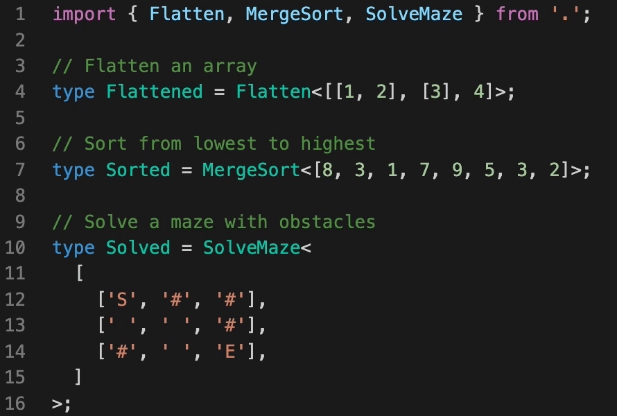

## 📚 Meta-Typing

> Functions and algorithms implemented purely with TypeScript's type system

### Introduction

[TypeScript](https://github.com/Microsoft/TypeScript)'s type system lets us catch bugs and errors in our code as we write it, instead of later on when the code runs. But... that's the obvious way to use the type system... 😜

This project attempts to push TypeScript's type system to its limits by actually implementing various functions and algorithms, purely on top of the type system.

Every implementation includes comments describing in detail what's going on. Some functions and algorithms use creative (and sometimes not officially supported) solutions to overcome [some limitations](https://github.com/microsoft/TypeScript/issues/26223#issuecomment-513187373) of the type system.

_☝ Please note that this project is meant to be used for fun and learning purposes and not for practical use._



### Try running the code

Start by installing dependencies:

```
$ yarn
```

Open a file of any function or algorithm and hover over the types to see the results of "running" that function with some input (try hovering the resulting type).

You can also run tests (written with [tsd](https://github.com/SamVerschueren/tsd)) with:

```
$ yarn test
```

### Functions and algorithms:

- **Math**:

  - [Basic arithmetic](src/utils/math.d.ts) - add one and decrease by one.
  - [Add](src/add/index.d.ts) - adds two numbers.
  - [Subtract](src/subtract/index.d.ts) - subtracts two numbers.
  - [Multiply](src/multiply/index.d.ts) - multiplies two numbers.
  - [Divide](src/divide/index.d.ts) - divides two numbers.
  - [Power](src/power/index.d.ts) - computes the given base taken to the power of the given exponent.
  - [Greater than or equal](src/gte/index.d.ts) - checks if a value is greater than or equal to another value.
  - [Less than or equal](src/lte/index.d.ts) - checks if a value is less than or equal to another value.
  - [Max](src/max/index.d.ts) - computes the maximum value of an array.
  - [Min](src/min/index.d.ts) - computes the minimum value of an array.
  - [Sum](src/sum/index.d.ts) - computes the sum of the values in array.
  - [Remainder](src/remainder/index.d.ts) - return the remainder (%) when one number is divided by a second number.

- **Lists**

  - [Head](src/head/index.d.ts) - gets the first element of an array.
  - [Tail](src/tail/index.d.ts) - gets all but the first element of an array.
  - [Reverse](src/reverse/index.d.ts) - Reverses an array so that the first element becomes the last, the second element becomes the second to last, and so on.
  - [Size](src/size/index.d.ts) - gets the size of an array.
  - [Concat](src/concat/index.d.ts) - creates a new array by concatenating two arrays together.
  - [Drop](src/drop/index.d.ts) - creates a slice of an array with `n` elements dropped from the beginning.
  - [Take](src/take/index.d.ts) - creates a slice of an array with `n` elements taken from the beginning.
  - [Uniq](src/uniq/index.d.ts) - creates a duplicate-free version of an array.
  - [Includes](src/includes/index.d.ts) - checks if a value is an array.
  - [IndexOf](src/indexOf/index.d.ts) - gets the index at which the first occurrence of a value is found in an array.
  - [Difference](src/difference/index.d.ts) - creates an array of values from the first array that are not included in the other given arrays.
  - [Intersection](src/intersection/index.d.ts) - creates an array of unique values that are included in all given arrays.
  - [Slice](src/slice/index.d.ts) - creates a slice of an array from start up to, but not including, end.
  - [Flatten](src/flatten/index.d.ts) - flattens an array a single level deep.
  - [Pull](src/pull/index.d.ts) - removes all given values from an array.
  - [Chunk](src/chunk/index.d.ts) - creates an array of elements split into groups the length of size.
  - [Zip](src/zip/index.d.ts) - creates an array of grouped elements, the first of which contains the first elements of the given arrays, the second of which contains the second elements of the given arrays, and so on.
  - [Range](src/range/index.d.ts) - creates an array of numbers progressing from start up to, but not including, end.

- **Sorting**

  - [Quick-sort](src/quickSort/index.d.ts) - an efficient sorting algorithm.
  - [Merge-sort](src/mergeSort/index.d.ts) - another efficient sorting algorithm.
  - [Insertion-sort](src/insertionSort/index.d.ts) - a simple sorting algorithm that builds the final sorted array (or list) one item at a time.

- **Utility**

  - [IsEqual](src/isEqual/index.d.ts) - compares between two values to determine if they are equivalent.

- **Puzzles**

  - [N-Queens](src/nQueens/index.d.ts) - the problem of placing N chess queens on an N×N chessboard so that no two queens threaten each other.
  - [Maze-solving](src/maze/index.d.ts) - find the shortest path to solve a maze with obstacles.
  - [Binary trees](src/binaryTrees/index.d.ts) - a tree data structure in which each node has at most two children.
  - [Square Matrix Rotation](src/rotateMatrix/index.d.ts) - you are given an N×N 2D matrix (representing an image). Rotate the matrix by 90 degrees (clockwise and counter-clockwise).
  - [Towers of Hanoi](src/hanoi/index.d.ts) - a mathematical game or puzzle that consists of three rods and a number of disks of different sizes.

### Additional links

- [Utility TypeScript types](https://www.typescriptlang.org/docs/handbook/utility-types.html)
- [Advanced TypeScript types](https://www.typescriptlang.org/docs/handbook/advanced-types.html)
- [Typing the Technical Interview in TypeScript](https://gal.hagever.com/posts/typing-the-technical-interview-in-typescript/)
- [TypeScripts Type System is Turing Complete](https://github.com/microsoft/TypeScript/issues/14833)
- [Emulating a 4-Bit Virtual Machine in TypeScript's type system](https://gist.github.com/acutmore/9d2ce837f019608f26ff54e0b1c23d6e)
- [Algorithms and data structures implemented in JavaScript](https://github.com/trekhleb/javascript-algorithms)
- [How to master advanced TypeScript patterns](https://github.com/pirix-gh/medium/blob/master/types-curry-ramda/src/index.ts)
